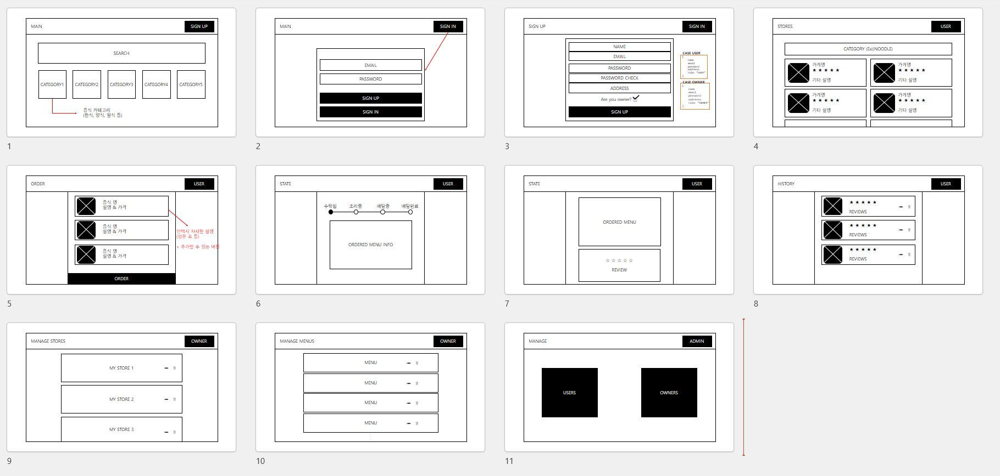
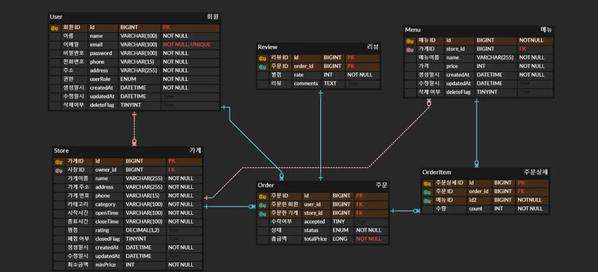

# 📝 프로젝트 소개
## 아웃소싱 프로젝트
#### 고객과 사장님을 위한 배달 어플리케이션 프로젝트입니다.
#### 사장님은 가게를 등록하고 메뉴를 관리할 수 있습니다.
#### 고객님은 원하는 메뉴를 주문할 수 있습니다.
#### JWT기반 인증의 보안 방식을 사용합니다.
#### 주문 수락, 상태 변경에 대한 로깅 기능이 적용되었습니다.
## 📅 프로젝트 기간 : 2025-02-28 ~ 2025-03-07
## 🛠️기술 스택
- 개발 언어 : Java 17
- 프레임 워크 : Spring Boot 3.4
- 데이터 베이스 : MySQL
- 빌드 도구 : Gradle
- 테스트 도구 : JUnit
- 보안 : JWT, Bcrypt
# 💁‍♂️ 프로젝트 팀원
|팀장|팀원|팀원|팀원|
|:-:|:-:|:-:|:-:|
|박승현|봉수현|이지은|전영준|

# 💻 맡은 역할
|    박승현    |   봉수현    |  이지은  |  전영준  |
|:---------:|:--------:|:-----:|:-----:|
| 메뉴, 리뷰 기능 | 유저, 리뷰기능 | 주문 기능 | 가게 기능 |

# 📝 와이어 프레임

# 📝API 명세서
https://www.notion.so/teamsparta/10-1a82dc3ef5148020ad17ca4a3bfd111e
# ERD 다이어그램

